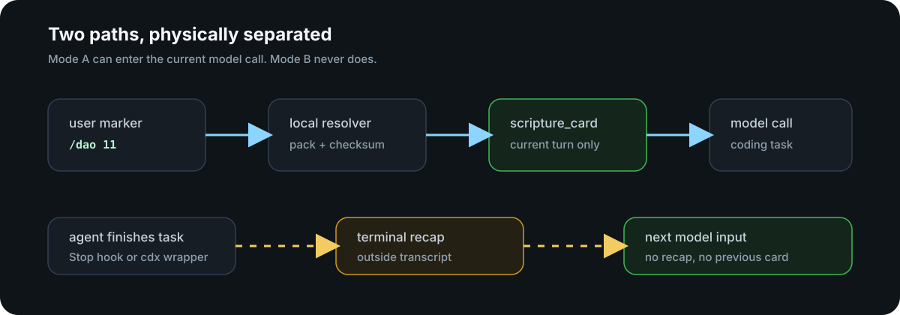
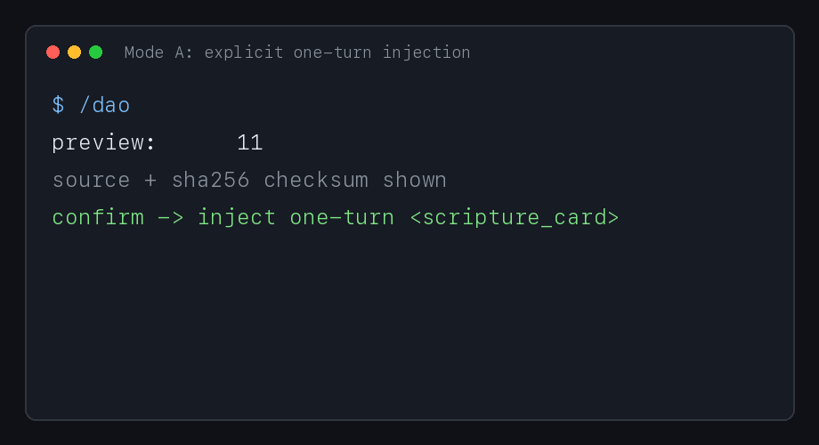
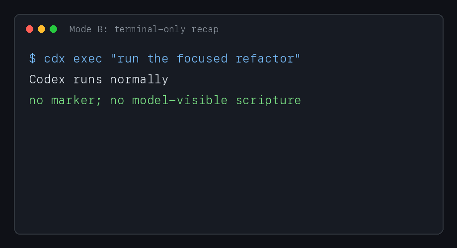
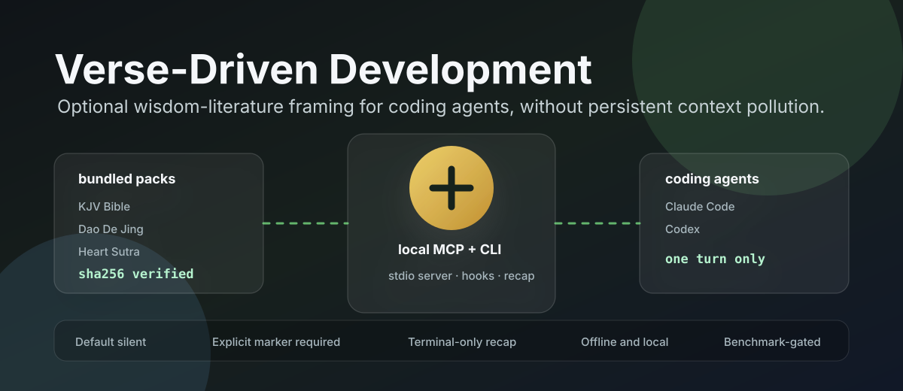

# Verse-Driven Development

[](https://github.com/MiaoDX/verse-driven/actions/workflows/ci.yml)
[](https://github.com/MiaoDX/verse-driven/releases)
[](./go.mod)
[](./LICENSE)
[](./docs/benchmarks/v0.1.md)
[](#why-local-stdio-mcp)

Optional scripture framing for coding agents, built so the framing never
quietly becomes permanent coding context.


`scripture-mcp` is a single local Go binary for Claude Code and Codex. It
serves bundled public-domain / attributed wisdom-literature packs through
stdio MCP, CLI commands, and agent hooks.

Current v0.1.0 status:

- Released binaries for macOS arm64, macOS x86_64, and Linux x86_64.
- Bundled packs: KJV Bible, 道德经, and 心经.
- Adapter support: Claude Code and Codex.
- Safety gate: one-turn injection lifecycle tests and coding-quality benchmark
  passed for v0.1.0.
- No remote service, no runtime Node/Python/Docker dependency.

## Quick Start

Install the latest release and wire detected agents:

```bash
curl -fsSL https://raw.githubusercontent.com/MiaoDX/verse-driven/main/install.sh | bash
```

Pin the release or skip agent wiring:

```bash
curl -fsSL https://raw.githubusercontent.com/MiaoDX/verse-driven/main/install.sh | bash -s -- --version v0.1.0
curl -fsSL https://raw.githubusercontent.com/MiaoDX/verse-driven/main/install.sh | bash -s -- --no-wire
curl -fsSL https://raw.githubusercontent.com/MiaoDX/verse-driven/main/install.sh | bash -s -- --prefix /usr/local/bin
```

Build from source:

```bash
go test ./...
make build
mkdir -p ~/.local/bin
cp bin/scripture-mcp ~/.local/bin/scripture-mcp
chmod +x ~/.local/bin/scripture-mcp
export PATH="$HOME/.local/bin:$PATH"
```

If Go module downloads are slow from mainland China:

```bash
go env -w GOPROXY=https://goproxy.cn,direct
go env -w GOSUMDB=sum.golang.google.cn
```

## What It Does

Verse-Driven Development has two deliberately separate modes.

| Mode | Trigger | Model sees it? | Purpose |
|---|---|---:|---|
| **Mode A: Manual frame** | You type a marker such as `/dao 11` or `$bible.John.3.13` | Current turn only | Use a passage as optional reflection for one coding task |
| **Mode B: Recap** | Agent task finishes | Never | Print a terminal-only recap or memory prompt |

The invariant is simple: a passage enters model input only when you explicitly
ask for it, and only for that turn.



## Examples

Claude Code slash commands:

```text
/bible John 3:13
/bible 约翰福音 3:16
/dao 第十一章
/sutra 心经
```

Codex inline markers:

```text
$dao.11 Refactor this scheduler. Preserve the cron-string API.
$bible.John.3.13 Refactor this parser.
[[bible:John 3:13]] Refactor this parser.
```

Direct CLI lookup:

```bash
scripture-mcp lookup "John 3:13" --format=json
scripture-mcp lookup "道德经第十一章" --format=text
scripture-mcp recap --terminal
scripture-mcp recap --learning --first-letter
```

Mode A demo:



Mode B demo:



## Why This Exists

Coding agents are sensitive to persistent context. Putting reflective or
spiritual material in `AGENTS.md`, `CLAUDE.md`, output styles, always-on hooks,
or system prompts can degrade normal engineering behavior because every future
task inherits it.

This project gives that workflow a narrower protocol:

- default silent behavior;
- explicit marker required for model-visible context;
- local lookup with checksummed bundled packs;
- one-turn-only injection envelope;
- terminal-only recap path for memory/reflection;
- automated leakage tests and coding-quality regression checks.

It follows the lineage of *The Tao of Programming*, Unix koans, and the Zen of
Python, but with real source texts and agent-context hygiene as the main design
constraint.

## Architecture



One binary, multiple interfaces:

```bash
scripture-mcp serve                              # stdio MCP server
scripture-mcp lookup "John 3:13" --format=json   # CLI lookup
scripture-mcp lookup-from-prompt                 # hook JSON output
scripture-mcp recap --terminal                   # terminal-only recap
scripture-mcp init --target=codex                # config wiring
```

```text
embedded packs ── resolver ── MCP server
       │              │             │
       │              │             ├─ Claude Code MCP
       │              │             └─ Codex MCP
       │              │
       └──────────── CLI ── hooks ── one-turn scripture_card
                         └───────── terminal-only recap
```

Most code is shared between Claude Code and Codex. The adapter-specific parts
are intentionally thin: config shape, marker syntax, and Codex's `cdx` wrapper
for recap because Codex has no Stop-hook equivalent.

## Why Local Stdio MCP

- **Fast:** lookup is local process I/O, not an HTTP round trip.
- **Offline:** packs are embedded with `embed.FS`.
- **Private:** no prompt or passage lookup leaves your machine.
- **Portable:** one static-ish Go binary for MCP, CLI, hooks, and recap.
- **Agent-neutral:** the same MCP server can be reused by other MCP-compatible
  tools.

## Agent Setup

`scripture-mcp init` splices marker-fenced snippets into user config files and
is safe to rerun.

```bash
scripture-mcp init --target=claude-code
scripture-mcp init --target=codex
scripture-mcp init --target=codex --learning=on
scripture-mcp init --target=claude-code --recap=off
scripture-mcp init --uninstall --target=codex
```

Learning mode stores schedule data in
`~/.config/scripture-mcp/learning.json`. It uses a small SM-2-style scheduler
to select due recap cards. `--first-letter` masks the recap body for memory
practice.

### Claude Code Assets

`init --target=claude-code` installs the MCP and hook config. The repo also
ships inspectable static assets:

```bash
mkdir -p ~/.claude/commands ~/.claude/output-styles ~/.claude/skills/verse-inject
ln -s "$PWD/adapters/claude-code/commands/bible.md" ~/.claude/commands/bible.md
ln -s "$PWD/adapters/claude-code/commands/dao.md" ~/.claude/commands/dao.md
ln -s "$PWD/adapters/claude-code/commands/sutra.md" ~/.claude/commands/sutra.md
ln -s "$PWD/adapters/claude-code/commands/quran.md" ~/.claude/commands/quran.md
ln -s "$PWD/adapters/claude-code/output-styles/scripture-recap.md" \
      ~/.claude/output-styles/scripture-recap.md
ln -s "$PWD/adapters/claude-code/skills/verse-inject/SKILL.md" \
      ~/.claude/skills/verse-inject/SKILL.md
```

These files contain no passage bodies. They call the local binary at lookup
time.

### Codex Assets

`init --target=codex` writes the MCP and `UserPromptSubmit` hook config.
Optional skill and wrapper assets:

```bash
mkdir -p ~/.codex/skills/scripture-lookup/agents
ln -s "$PWD/adapters/codex/skills/scripture-lookup/SKILL.md" \
      ~/.codex/skills/scripture-lookup/SKILL.md
ln -s "$PWD/adapters/codex/skills/scripture-lookup/agents/openai.yaml" \
      ~/.codex/skills/scripture-lookup/agents/openai.yaml

cp adapters/codex/wrapper/cdx ~/.local/bin/cdx
chmod +x ~/.local/bin/cdx
```

Run `cdx ...` instead of `codex ...` when you want Mode B recap. Launching
`codex` directly bypasses recap by design, which keeps recap text outside the
Codex transcript.

## Packs

| Pack | Source | State |
|---|---|---|
| KJV Bible | [Project Gutenberg eBook #10](https://www.gutenberg.org/ebooks/10) | Bundled, 31,102 verses |
| 道德经 | [Project Gutenberg eBook #7337](https://www.gutenberg.org/ebooks/7337) | Bundled, 81 chapters |
| 心经 | [CBETA XML P5 T0251](https://cbetaonline.dila.edu.tw/zh/T0251_001) | Bundled, 1 complete text |
| Quran | planned | Resolver only; no bundled text |
| 中文圣经 | planned | Needs licensing work |

Each bundled entry stores a SHA-256 checksum over the text bytes. CI verifies
that pack text and checksum metadata stay in sync.

## Verification

The v0.1.0 release gate is published in
[`docs/benchmarks/v0.1.md`](./docs/benchmarks/v0.1.md).

What is tested:

- injected context is available on turn N;
- injected context is gone on later turns;
- recap output does not enter future model inputs;
- both Claude and Codex hook event shapes are covered;
- 10 coding fixtures run across baseline, preview-only, inject-once, and
  recap-only modes;
- no tested mode regressed success rate versus baseline.

Local checks:

```bash
make lint
python3 scripts/verify_quotes.py
go test ./...
make build
```

## Release

Current release: [v0.1.0](https://github.com/MiaoDX/verse-driven/releases/tag/v0.1.0)

Artifacts:

- `scripture-mcp-v0.1.0-darwin-arm64.tar.gz`
- `scripture-mcp-v0.1.0-darwin-x86_64.tar.gz`
- `scripture-mcp-v0.1.0-linux-x86_64.tar.gz`
- `checksums.txt`

See [`CHANGELOG.md`](./CHANGELOG.md) for release notes.

## Contributing

Useful next work:

- Quran pack with clear source provenance and attribution.
- Chinese Bible pack research.
- Homebrew formula.
- Release workflow automation.
- Additional lifecycle probes for other MCP-compatible agents.

When touching pack data, avoid printing passage bodies in logs or PR text.
Use checksums, counts, IDs, and source metadata for verification.

## Acknowledgments

- [hesreallyhim/awesome-claude-code-output-styles-that-i-really-like](https://github.com/hesreallyhim/awesome-claude-code-output-styles-that-i-really-like)
- [Traves-Theberge/sacred-scriptures-mcp](https://github.com/Traves-Theberge/sacred-scriptures-mcp)
- [quran/quran-mcp](https://github.com/quran/quran-mcp)
- [Gentleman-Programming/engram](https://github.com/Gentleman-Programming/engram)
- [The Tao of Programming](https://www.mit.edu/~xela/tao.html)
- [The Zen of Python](https://peps.python.org/pep-0020/)

## License

Code is MIT licensed. Bundled data keeps its own upstream attribution metadata;
see each pack's `metadata.json`.
